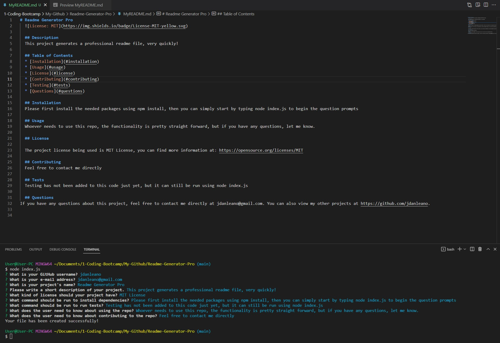

# Readme Generator Pro




This is my completed code for the Module 09 challenge this week. We were given a task to create a README.md file generator to create a professional README file using question prompts with node.js.

## User Story

```
AS A developer
I WANT a README generator
SO THAT I can quickly create a professional README for a new project
```

The Acceptance Criteria is as follows:

## Acceptance Criteria

```
GIVEN a command-line application that accepts user input
WHEN I am prompted for information about my application repository
THEN a high-quality, professional README.md is generated with the title of my project and sections entitled Description, Table of Contents, Installation, Usage, License, Contributing, Tests, and Questions
WHEN I enter my project title
THEN this is displayed as the title of the README
WHEN I enter a description, installation instructions, usage information, contribution guidelines, and test instructions
THEN this information is added to the sections of the README entitled Description, Installation, Usage, Contributing, and Tests
WHEN I choose a license for my application from a list of options
THEN a badge for that license is added near the top of the README and a notice is added to the section of the README entitled License that explains which license the application is covered under
WHEN I enter my GitHub username
THEN this is added to the section of the README entitled Questions, with a link to my GitHub profile
WHEN I enter my email address
THEN this is added to the section of the README entitled Questions, with instructions on how to reach me with additional questions
WHEN I click on the links in the Table of Contents
THEN I am taken to the corresponding section of the README
```

What I did to complete this challenge is take each individual criteria one at a time, while also trying to minimize repetativeness in the code. I started with installing inquirer using `npm i inquirer@8.2.4`, then I included `fs` to write my inputs to a .md file. I also made sure to connect the generateMarkdown.js file to the index.js file.

I then started adding the function for all the different questions that need to be asked to add the answers to the README file. I went on to write the function to create the README file based on the answers that were used in the question prompts. I then needed to make sure the functions were called at the bottom of the index.js page so that the code would run properly. After that, I starterd to work on the generateMarkdown.js file. This is where the functions for the licence badge, license link, and license section are entered. This is also where the README template is and where we plug the answers into.

## Please see attached links to Repository and Walkthrough Video:
### https://github.com/jdanleano/Readme-Generator-Pro
### 
